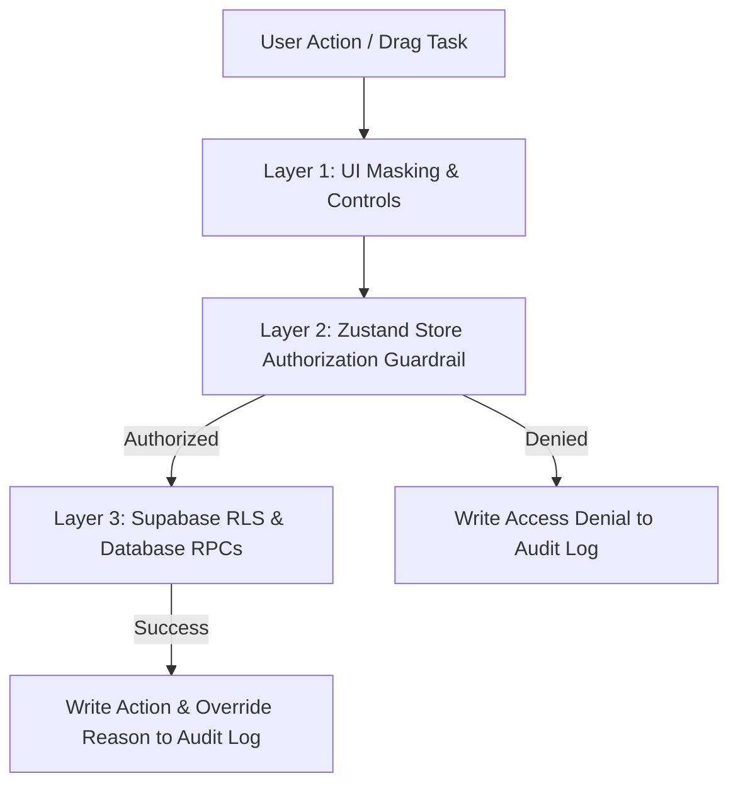

# DizruptOS — Enterprise Resource & Capacity Intelligence Platform

> **A high-performance workforce capacity management system delivered as a full in-browser macOS-style Desktop Operating System.**
> 
> *Built with Next.js 14 (App Router), TypeScript, Zustand, Tailwind CSS, TanStack Query/Table, and Supabase (PostgreSQL + RLS).*

---

## ⚡ Executive Summary & Recruiter Highlights

**DizruptOS** addresses a critical operational failure in enterprise engineering and product organizations: **unseen workforce burnout and misallocated team capacity**. 

Instead of traditional, siloed dashboards, DizruptOS unifies task management, capacity planning, organizational intelligence, and compliance guardrails into a **fluid web desktop environment**. Users experience multi-stage OS boot sequences, draggable/resizable windows, dock magnification, Spotlight search, Mission Control window tiling, and live cross-app data synchronization.

```
┌──────────────────────────────────────────────────────────────────────────────────────────┐
│                                   DIZRUPTOS SYSTEM SHELL                                 │
├──────────────────────────────────────────────────────────────────────────────────────────┤
│ [ App] [File] [Edit] [View] [Window]                           [🔋 100%] [⌘ 18:42] [👤 Asha] │
├──────────────────────────────────────────────────────────────────────────────────────────┤
│  ┌─────────────────────────┐  ┌───────────────────────────────────────────────────────┐ │
│  │ ⚡ Capacity Heatmap     │  │ 📊 Project Matrix (Kanban)                            │ │
│  ├─────────────────────────┤  ├───────────────────────────────────────────────────────┤ │
│  │ Diego F.  [█████████ 118%] │ Overload! │ [Backlog]      [In Progress]     [Done]       │ │
│  │ Ahmed H.  [████░░░░  55%] │ Available │ ┌───────────┐  ┌───────────┐  ┌───────────┐ │ │
│  │ └─ Drag task chip →       │           │ │ Task #104 │  │ Task #201 │  │ Task #088 │ │ │
│  └─────────────────────────┘           │ └───────────┘  └───────────┘  └───────────┘ │ │
│                                       └───────────────────────────────────────────────┘ │
│                                                                                          │
│  [  🏠 Home  ] [  ⚡ Capacity  ] [  📊 Projects  ] [  👥 Directory  ] [  📈 Executive  ] │
└──────────────────────────────────────────────────────────────────────────────────────────┘
```

### 🎯 Key Engineering Achievements & Verified Metrics

| Metric / Specification | Value / Status | Engineering Impact |
|---|---|---|
| **Unit & Integration Suite** | **329 Tests Passing** (Vitest) | 100% passing rate in ~2.3s; covers store math, RBAC, copilot, and engine contracts |
| **End-to-End Smoke Tests** | **16 Automated Tests** (Playwright) | Automated browser testing across multi-persona login, windowing, and route gates |
| **Type Safety & Quality** | **0 Errors** (`tsc --noEmit` & `next lint`) | Strict TypeScript 5 mode with complete Zod schema API validation |
| **Database Schema & Security** | **20 Sequential SQL Migrations** | 32 PostgreSQL tables with strict Row-Level Security (RLS) and custom Auth Hooks |
| **Security Architecture** | **3-Layer RBAC Defense** | UI masking + Zustand store execution denial + Database-level mutation blocking |
| **UI Performance** | **< 10ms State Synchronization** | Optimistic UI mutations coupled with cross-tab `BroadcastChannel` event syncing |

---

## 🎨 Visual System Preview

| macOS Desktop Experience | Control Center & System Customization |
|---|---|
|  |  |

---

## 💡 The Core Problem & Architectural Philosophy

### 1. The Enterprise Workforce Dilemma
Modern enterprises manage work using fragmented tooling:
* **Task Trackers (Jira/Linear):** Record *what* tasks need to be completed.
* **HR Systems (Workday/BambooHR):** Record *who* is employed.
* **Spreadsheets:** Attempt to manually reconcile team workloads across quarters.

Because these tools operate in silos, managers regularly assign high-priority tasks to team members who are already severely overallocated across separate initiatives. This results in **unannounced project delays, severe burnout, quality degradation, and key personnel attrition**.

### 2. Core Architectural Philosophy
DizruptOS resolves this through three core principles:
* **Predictive Capacity Mapping ("See the break before the break"):** Over-allocation is flagged visually weeks before deadline failures occur.
* **Causal Signals ("Never a score without a why"):** Every metric (health scores, burnout flags, risk indexes) exposes its underlying causal data on click.
* **Atomic Capacity Guardrails:** Employee load is calculated mathematically (`utilization = Σ estimated hours ÷ weekly capacity limit`). Dropping a task onto an employee at $\ge 100\%$ capacity trips a hard-stop override modal requiring a typed, audit-logged justification.

---

## 🖥️ Web OS Desktop Architecture

DizruptOS features a custom window management engine built on React and Zustand (`dizruptos/src/lib/os.ts` & `dizruptos/src/components/desktop/use-desktop.ts`).

### 1. Boot & Lock Sequence
* **Multi-Stage Boot Engine:** Simulates system startup (`booting` $\rightarrow$ `lock screen` $\rightarrow$ `desktop`).
* **Instant Persona Switcher:** Allows evaluators to seamlessly toggle between `Admin`, `Manager`, `Executive`, and `Employee` roles, as well as test live passwordless email and SSO flows via Supabase Auth.

### 2. Window Management Engine
* **8-Way Resizing & Smooth Dragging:** Windows resize from any corner or edge and drag across the viewport with frame isolation.
* **Snap Tiling & Maximization:** Supports left/right half-tile snapping and full-screen expansion.
* **Genie Minimize Effect:** Smoothly animates active app windows into their respective Dock icons.
* **Focus & Z-Ordering:** Intelligent z-index management brings active windows to the foreground dynamically.
* **Per-User State Persistence:** Remembers user window placement and layout across sessions.

### 3. Desktop Navigation Infrastructure
* **Magnifying Dock:** Interactive launcher with hover magnification, active app running indicators, and launch-bounce animations.
* **Global Menubar & System Tray:** Top bar providing OS controls, live network status, battery level, calendar dropdown, and a live **Control Center** (theme switcher, wallpaper selector, accent color engine).
* **System Overlay Shortcuts:**
  * **Spotlight (`⌘ + Space`):** Global search querying employees, tasks, projects, risks, and OS settings.
  * **Mission Control (`F3`):** Dynamically tiles all open desktop windows for instant app switching.
  * **Launchpad (`F4`):** Full-screen grid view of all installed native OS applications.

---

## 🚀 Core Application Catalog

```
dizruptos/src/components/desktop/apps/
├── capacity/          ← 6-week rolling workload heatmap & drag reallocation
├── home/              ← Persona Today/Pending/Critical task command center
├── projects/          ← Multi-project Kanban board & causal diagnostics
├── people/            ← TanStack dense directory, skill search & burnout panels
├── executive/         ← Revenue-at-Risk, OHI, Strategy Drift & AI Briefs
├── proposals/         ← AI Agent Negotiation Inbox & coordinated compromise
├── risks/             ← Auto-calculated Probability × Impact risk matrix
├── decisions/         ← Immutable decision ledger & calibration history
├── graph/             ← React Flow (@xyflow/react) organizational relationship graph
└── audit/             ← Insert-only compliance audit trail
```

### Key Modules Detailed
1. **Capacity Heatmap (`/capacity`):** The primary capacity management surface. Color-coded load bars (**Green** $<85\%$, **Amber** $85–99\%$, **Red** $\ge 100\%$). Includes drag-and-drop task reallocation with optimistic updates and hard-stop overallocation guardrails.
2. **Executive Intelligence (`/executive`):** Real-time strategic analytics tracking Revenue-at-Risk, Strategy Drift, and Organizational Health Index (OHI) with interactive comparative charts.
3. **Agent Negotiation Inbox (`/proposals`):** Evaluates AI agent recommendations for workload distribution. Features 2-click approve/reject actions with 30-day rejection memory learning loops.
4. **Organizational Graph (`/graph`):** Dynamic graph visualization powered by `@xyflow/react` showing canonical typed edges (`funds`, `threatened_by`, `causes`).

---

## 🛠️ Security, RBAC & Architecture

### 3-Layer Defense-in-Depth Model



1. **Layer 1 (UI Level):** Components inspect `useSession().can(perm)` to dynamically render or disable UI controls.
2. **Layer 2 (Store Level):** Zustand mutations call `useSession.getState().can(perm)`. Unauthorized actions fail gracefully, setting an actionable error message while recording a denial entry in the system audit trail.
3. **Layer 3 (Database Level):** Supabase Row-Level Security (RLS) policies and PostgreSQL functions (`reallocate_task` RPC) enforce data isolation and mutation authority.

### Role Hierarchy & Permissions

```
client → employee → team_lead → project_manager → dept_head → executive → admin
```

| Permission | `employee` | `team_lead` | `project_manager` | `dept_head` | `executive` | `admin` |
|---|:---:|:---:|:---:|:---:|:---:|:---:|
| `view_capacity` | ❌ | ✅ | ✅ | ✅ | ✅ | ✅ |
| `reallocate` | ❌ | ❌ | ✅ | ✅ | ❌ | ✅ |
| `view_burnout` | ❌ | ✅ | ✅ | ✅ | ❌ | ✅ |
| `view_financials` | ❌ | ❌ | ❌ | ✅ | ✅ | ✅ |
| `view_audit` | ❌ | ❌ | ❌ | ✅ | ❌ | ✅ |
| `review_proposals` | ❌ | ❌ | ✅ | ✅ | ❌ | ✅ |
| `view_executive` | ❌ | ❌ | ❌ | ✅ | ✅ | ✅ |

---

## 🧪 Testing & Verification Suite

DizruptOS maintains strict quality standards through comprehensive automated testing:

```bash
# Execute full Vitest suite (329 tests)
npm test

# Execute Playwright E2E smoke tests (16 tests)
npm run e2e

# Execute strict TypeScript validation
npm run typecheck
```

### Verified Test Output
* **38 Test Files Passed** (100% pass rate)
* **329 Total Tests Passed** (Store state, RBAC rules, alert engines, copilot logic, CSV imports)
* **16 Playwright E2E Tests Passed** (Full application boot, persona switches, API routes, and RBAC assertion checks)

---

## 👥 Evaluator Persona Cheat Sheet

When reviewing the live application or running locally, use the top menubar profile dropdown or the session picker on the lock screen to test distinct persona permissions:

| Persona ID | Name | Role | Primary Features Accessible |
|---|---|---|---|
| `u-noor` | Noor Al-Rashid | `executive` | Executive Dashboard, Revenue at Risk, OHI, Strategy Drift |
| `u-priya` | Priya Sharma | `dept_head` | Department Financials, Capacity Heatmap, Audit Logs, Proposals |
| `u-asha` | Asha Venkat | `project_manager` | Task Reallocation, Capacity Heatmap, Project Matrix, Proposals |
| `u-sarah` | Sarah Okafor | `team_lead` | Team Capacity Viewing, Burnout Risk Panels, Task Tracking |
| `u-ahmed` | Ahmed Hassan | `employee` | Personal Command Center, Assigned Tasks, Directory |
| `u-elias` | Elias Brandt | `admin` | Full Unrestricted Access, System Configuration, All Operations |

---

## 🏭 Enterprise Scaling Considerations

While optimized for high-velocity demonstration, DizruptOS incorporates production-ready scaling paths:

1. **Authentication Gate:** Demo mode utilizes persona cookies (`dz_session`) for instant evaluation. Switching to production mode strictly enforces Supabase JWT session validation via Edge middleware (`src/middleware.ts`).
2. **Asynchronous Processing:** Heavy AI graph analysis and simulation engines are built as isolated modules (`src/server/engine/`), ready to be offloaded to event queues (Temporal/Inngest) with WebSocket pushes to the client.
3. **Graph Rendering Performance:** The org graph uses `@xyflow/react` for crisp DOM rendering. For enterprise deployments exceeding 50,000 nodes, the modular graph container is structured for seamless upgrade to WebGL/Canvas rendering.

---

## 🚀 Quick Start Guide

### Prerequisites
* **Node.js:** `v20.x` or `v22.x` (pinned in `.nvmrc`)
* **npm:** `v10.x` or higher

### Local Installation & Execution

```bash
# 1. Navigate to application folder
cd dizruptos

# 2. Install dependencies
npm install

# 3. Start local development server (Demo Mode — zero config needed)
npm run dev
```

Open [http://localhost:3000](http://localhost:3000) in your browser to experience the OS boot sequence.

---

## 📐 Project Structure

```
DizruptOS/
├── README.md                      ← Primary project documentation
├── CLAUDE.md                      ← Engineering architectural directives
└── dizruptos/                     ← Next.js application root
    ├── src/
    │   ├── app/                   ← App Router (Shell routes, Auth, REST API v1)
    │   ├── components/
    │   │   ├── desktop/           ← OS Shell (Dock, Window, Menubar, Spotlight)
    │   │   ├── desktop/apps/      ← Native OS apps (Capacity, Projects, Executive...)
    │   │   └── ui/                ← Radix UI primitives & design tokens
    │   ├── lib/                   ← Core state (Zustand), RBAC, Types, Seed data
    │   └── server/                ← Repositories (Memory/Supabase) & AI engines
    ├── supabase/                  ← 20 SQL schema migrations & seed files
    ├── e2e/                       ← Playwright browser smoke test suite
    └── package.json
```

---

*Designed and engineered as a demonstration of production-grade full-stack architecture, web OS UI engineering, and enterprise system design.*
