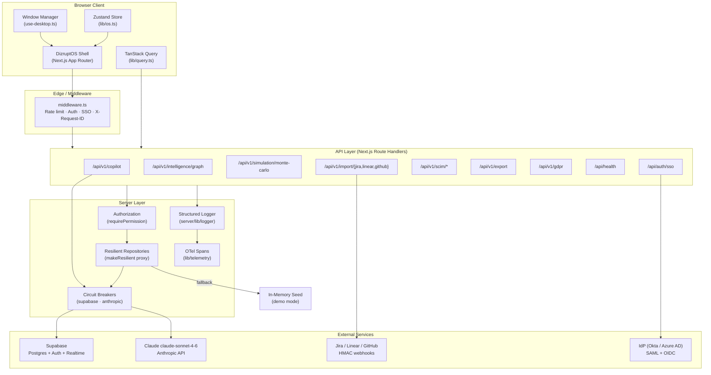
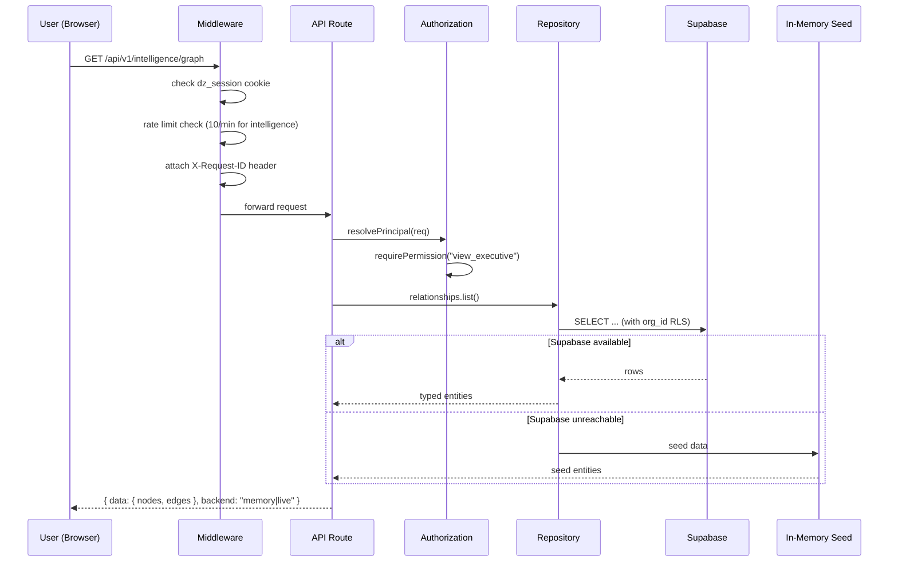
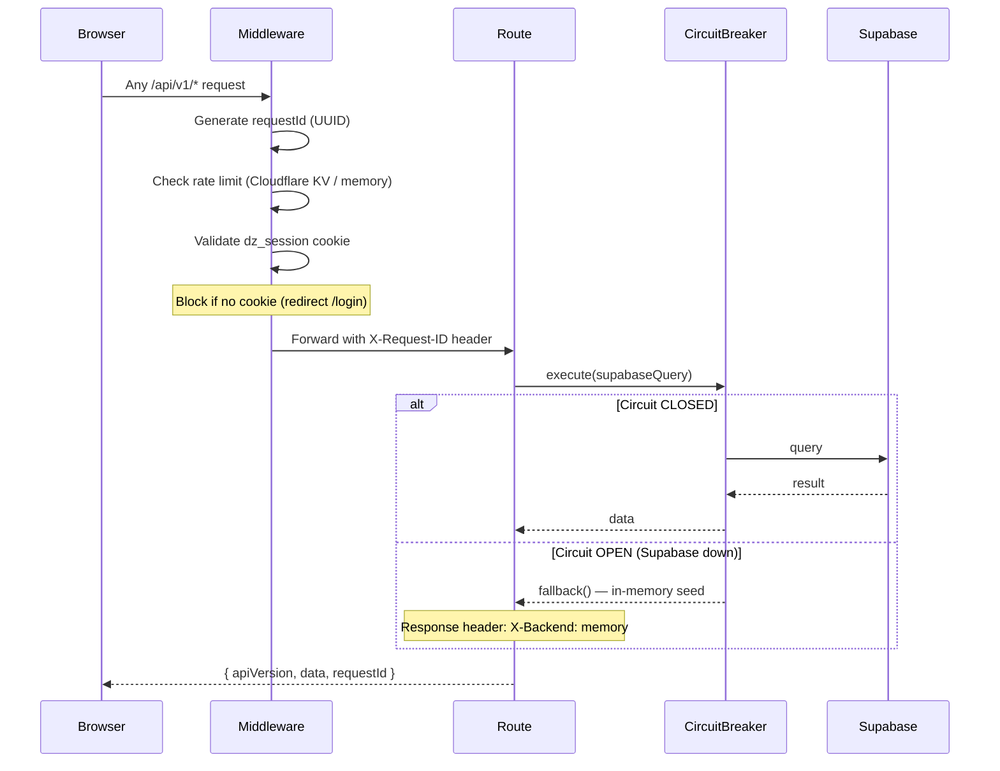
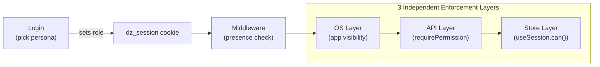
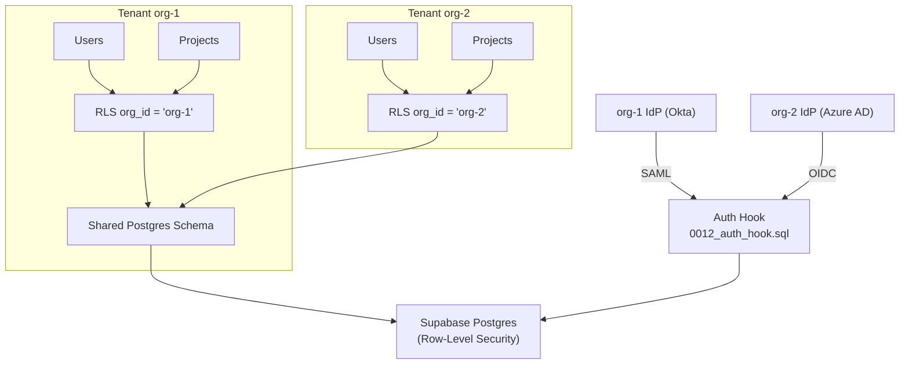
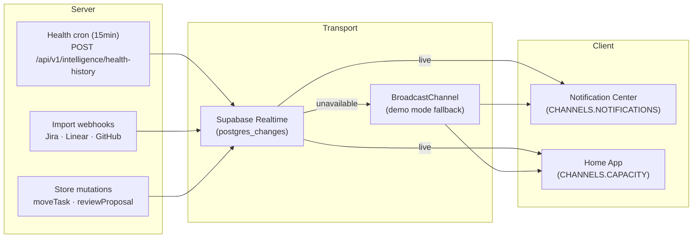
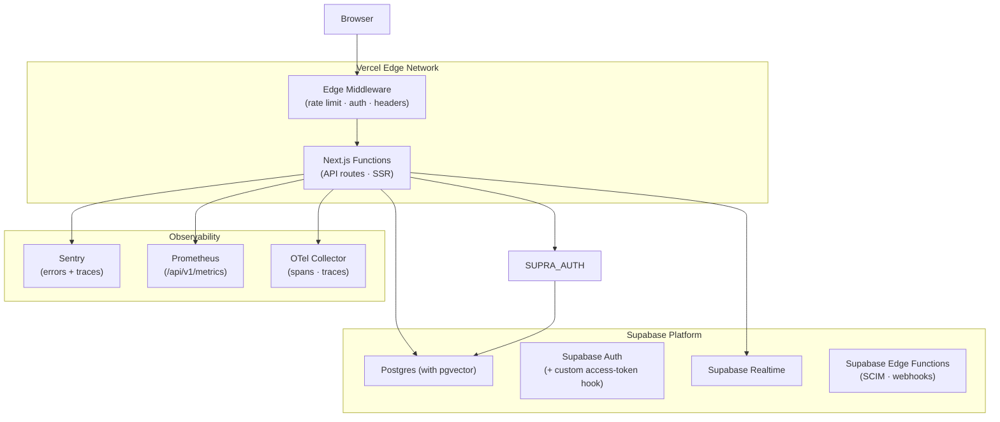

# DIZRUPT — Architecture Diagrams

## System Overview

## Data Flow — Intelligence Pipeline

## Request Lifecycle

## RBAC Enforcement Model

## Multi-Tenancy Architecture

## Realtime Architecture

## Deployment Architecture

