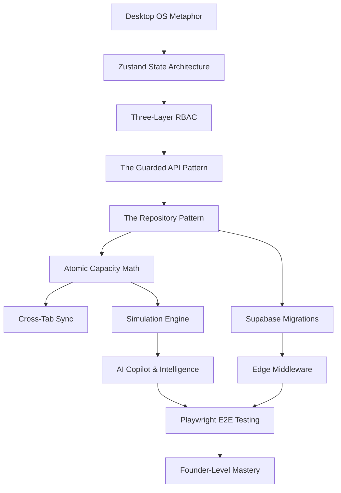

# DIZRUPT Curriculum

This curriculum is designed to transform a senior engineer into a Founder-Level Expert on DizruptOS.

## Learning Phases

### Phase 1: Foundation (Weeks 1-2)
**Goal:** Understand the application shell, state management, and the dual-backend philosophy.
1. **The Desktop OS Metaphor:** Dive into how `Next.js` renders a macOS-style desktop instead of a traditional web page.
2. **Three-Layer RBAC:** Study the single most important security principle in the platform.
3. **Zustand State Architecture:** Master `useSession`, `useOS`, and `useOps`.
4. **The Repository Pattern:** Learn how DizruptOS seamlessly swaps between in-memory mock data and a live PostgreSQL database.

### Phase 2: The Core Domain (Weeks 3-4)
**Goal:** Master the business logic, atomic capacity math, and API layer.
1. **Atomic Capacity Math:** Understand why we apply deltas instead of direct overwrites to employee capacity.
2. **The Guarded API Pattern:** Learn the structure of `/api/v1` routes and how `guarded()` enforces security.
3. **Data Ingestion Pipeline:** Study the resilient CSV/HRIS ingestion system.
4. **Cross-Tab Synchronization:** Study how `BroadcastChannel` works in demo mode and `Supabase Realtime` in production.

### Phase 3: Artificial Intelligence & Simulation (Weeks 5-6)
**Goal:** Understand the AI capabilities, heuristics, and predictive models.
1. **The Gemini Copilot:** How natural language translates into system actions.
2. **Risk & People Intelligence:** The heuristics behind churn prediction and employee burnout.
3. **Simulation Engine:** How what-if scenarios branch off the main state.
4. **Organizational Health Mathematics:** The formulas that aggregate risk, capacity, and morale.

### Phase 4: Data Layer & Production Hardening (Weeks 7-8)
**Goal:** Master Supabase, PostgreSQL RLS, Edge Middleware, and Testing.
1. **Supabase Schema & Migrations:** Study the SQL migrations sequentially.
2. **Edge Middleware:** CORS, CSRF, Rate Limiting, and Session routing.
3. **Playwright E2E Testing:** How we test an OS in a headless browser by injecting persona cookies.
4. **CI/CD Pipeline:** The GitHub actions that keep the master branch green.

---

## Dependency Graph

## Milestones
* **Milestone 1:** Build a new desktop app that correctly respects `useOS` window management and `useSession` themes.
* **Milestone 2:** Implement a new guarded API endpoint using `getRepositories()` and query it from the UI.
* **Milestone 3:** Add a new heuristic to the Risk Intelligence engine and surface it in the node graph.
* **Milestone 4 (Founder Level):** Confidently debug an E2E test failure related to RBAC permissions across different personas.
