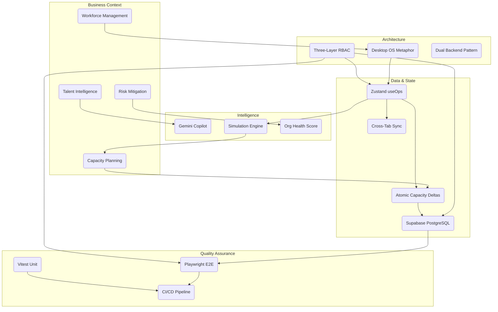

# DizruptOS Knowledge Graph

This graph illustrates the interconnected dependencies across the DizruptOS architecture.

## Concept Dependencies

* **To understand `useOps`**, you must first understand the **Desktop OS Metaphor** and **Three-Layer RBAC**.
* **To understand the Simulation Engine**, you must first master **Zustand `useOps`** and deep-cloning algorithms.
* **To understand Playwright E2E**, you must understand the **Persona System** (RBAC) and how cookies define identity.
* **To modify the API**, you must understand the **Repository Pattern** (Dual Backend) and the **Guarded API wrapper**.
